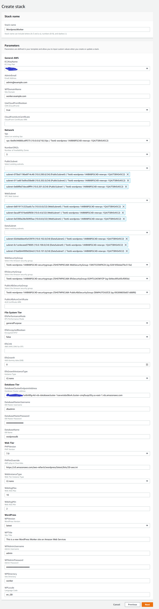

# **Hosting WordPress Worker on AWS**

### Version 1.0.0

This reference architecture provides a set of YAML templates for deploying and attaching WordPress Wokrer on AWS using [Amazon Virtual Private Cloud (Amazon VPC)](http://docs.aws.amazon.com/AmazonVPC/latest/UserGuide/VPC_Introduction.html), [Amazon Elastic Compute Cloud (Amazon EC2)](http://docs.aws.amazon.com/AWSEC2/latest/UserGuide/concepts.html), [Auto Scaling](http://docs.aws.amazon.com/autoscaling/latest/userguide/WhatIsAutoScaling.html), [Elastic Load Balancing (Application Load Balancer)](https://docs.aws.amazon.com/elasticloadbalancing/latest/application/introduction.html), [Amazon Relational Database Service (Amazon RDS)](http://docs.aws.amazon.com/AmazonRDS/latest/UserGuide/Welcome.html), [Amazon ElastiCache](http://docs.aws.amazon.com/AmazonElastiCache/latest/UserGuide/WhatIs.html), [Amazon Elastic File System (Amazon EFS)](http://docs.aws.amazon.com/efs/latest/ug/whatisefs.html), [Amazon CloudFront](http://docs.aws.amazon.com/AmazonCloudFront/latest/DeveloperGuide/Introduction.html), [Amazon Route 53](http://docs.aws.amazon.com/Route53/latest/DeveloperGuide/Welcome.html), [Amazon Certificate Manager (Amazon ACM)](http://docs.aws.amazon.com/acm/latest/userguide/acm-overview.html)  with [AWS CloudFormation](http://docs.aws.amazon.com/AWSCloudFormation/latest/UserGuide/Welcome.html).

## Overview

The repository consists of a set of nested templates which are run in order from the master template. Run the master template to create the entire stack, entering the appropriate parameters. Nested templates can be run individually in order, entering the appropriate input parameters for each stack.

## Parameters

## Steps to Run
To launch the entire stack and deploy a WordPress site on AWS, click on one of the ***Launch Stack*** links below or download the Master template and launch it locally.

You can launch this CloudFormation stack, using your account, in the following AWS Regions:

| AWS Region Code | Name | Launch |
| --- | --- | --- 
| us-east-1 |US East (N. Virginia)|  |
| us-east-2 |US East (Ohio)|  |
| us-west-2 |US West (Oregon)|  |
| eu-west-1 |EU (Ireland)|  |
| eu-central-1 |EU (Frankfurt)|  |
| ap-southeast-2 |AP (Sydney)|  |

#### Select WordPress version

The version of WordPress can be selected. Possible values are latest, nightly, 4.5, 4.6, 4.7, 4.8, 4.9.

#### Override PHP.ini defaults by downloading an overrides ini file from Amazon S3

Create a custom .ini file that includes PHP overrides and make it publically available in an S3 bucket. These could be common overrides like **memory_limit**, **post_max_size**, **upload_max_filesize**, **max_input_time**, **max_execution_time**, etc. Amazon S3 object path should use https format (e.g.https://s3.amazonaws.com/aws-refarch/wordpress/latest/bits/20-aws.ini). Sample PHP overrides are below and in the [samples/20-aws.ini](samples/20-aws.ini) directory.

; Enable php.ini overrides for hosting WordPress on AWS - https://github.com/awslabs/aws-refarch-wordpress

memory_limit = 128M

post_max_size = 0

upload_max_filesize = 64M

max_input_time = 60

max_execution_time = 30

#### Stack Creation

There are one output URLs for this template. The WPSiteURL will take you to your new WordPress site. It will be the site domain name if you provided one, the CloudFront URL if you chose to create a CloudFront distribution, or the domain name of the public application load balancer.

## Master Template
The master template receives all input parameters and passes them to the appropriate nested template which are executed in order based on conditions and dependencies.
Review the template here [aws-refarch-wordpress-worker.yaml](templates/aws-refarch-wordpress-worker.yaml)

### AWS Resources Created:

- Amazon Elastic File System (Amazon EFS) file system - with mount targets in private subnets (data) w/ optional dummy data to grow the file system to achieve higher levels of throughput and IOPS
- File System Auto Scaling Group (launching 1 instance) - to add dummy data (it auto terminates by setting ASG desired count to 0)
- Amazon Elastic Load Balancing (Amazon ELB) Application Load Balancer (ALB) - in public subnets (public)
- Web Auto Scaling Group (launching 2 instances) - in private subnets (web)
- Amazon CloudFront distribution (optional)

### Input Parameters

#### General AWS
- EC2 Key Name Pair
- Email address for WordPress administration and SNS notifications
- Site Domain Name (e.g. 'example.com') - use this only if you will use your own custom domain name
- Select if you want to use a AWS CloudFront to cache images at AWS edge locations (3rd party plugins are required to leverage a CDN)
- Enter the ARN of the AWS Certificate Manager certificate you created in us-east-1 for your custom site domain name

#### Network
- VPC: Select the VPC where wordpress is currently running
- Number of Avilability Zones (AZs) - Should be same as Wordpress VPC
- PublicSubnet - Select existing public subnet
- WebSubnet - Select existing web subnet
- DataSubnet - Select existing data subnet
- WebSecurityGroup - Select existing web security group
- EfsSecurityGroup - Select existing Efs security group
- PublicAlbSecurityGroup - Select existing Public Alb security group

#### File System
- Amazon EFS performance mode
- Encrypted file system (boolean)
- AWS KMS Customer Master Key ARN (if enabling encryption and using customer-managed CMK)
- Add dummy data to the file system to achieve higher throughput & IOPS beyond the amount of data your WordPress environment will use. This value is in GiB.
- The instance type that will be used to dd dummy data into the file system

#### Database
- Wordpress Database Cluster Address
- Wordpress Database Master Username
- Wordpress Database Master Password
- Wordpress Database Name

#### Web Parameters
- PHP Version (5.5, 5.6, or 7.0 - recomended)
- Web Instance Type
- The maximum number of instances in the web tier auto scaling group
- The minimum (and desired) number of instances in the web tier auto scaling group

#### WordPress Parameters
- WordPress Title
- WordPress Administrator Username
- WordPress Administrator Username Password
- WordPress Main Language of the site
- Wordpress Site Directory